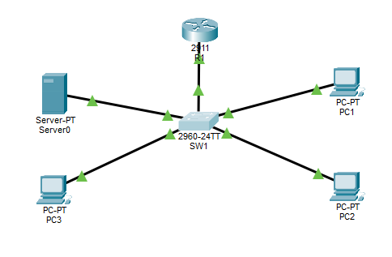
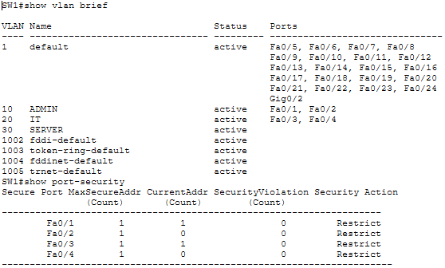
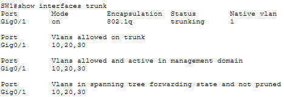
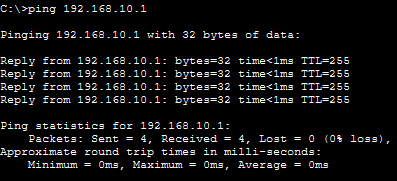
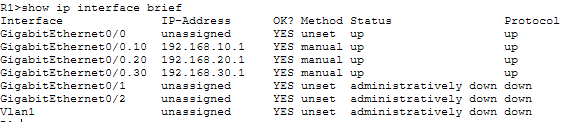
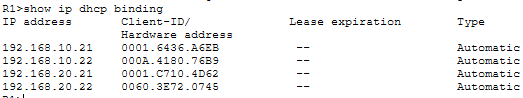

# 🔐 Secure Small Business Network

A secure small-business network designed and configured using **Cisco Packet Tracer**.

## 📌 Project Overview

This project demonstrates the configuration of a small business network with basic network segmentation, routing, DHCP services, remote administration, and Layer 2 security controls.

The project focuses on applying practical concepts learned from:

* Cisco Networking Basics
* Introduction to Cybersecurity
* Networking Devices and Initial Configuration

## 🎯 Objectives

* Configure a Cisco router and switch
* Create and configure VLANs
* Implement inter-VLAN routing using Router-on-a-Stick
* Configure DHCP on the router
* Configure secure SSH remote access
* Configure console and privileged EXEC security
* Implement switch port security
* Secure unused switch ports
* Configure a security warning banner
* Test network connectivity

## 🖥️ Network Topology

The network consists of:

* 1 × Cisco 2911 Router — R1
* 1 × Cisco 2960 Switch — SW1
* 3 × PCs
* 1 × Server



## 🌐 VLAN Configuration

| VLAN | Name   | Network         | Gateway      |
| ---- | ------ | --------------- | ------------ |
| 10   | ADMIN  | 192.168.10.0/24 | 192.168.10.1 |
| 20   | IT     | 192.168.20.0/24 | 192.168.20.1 |
| 30   | SERVER | 192.168.30.0/24 | 192.168.30.1 |

## 🔀 Switch Port Assignment

| Switch Port | Device | VLAN    |
| ----------- | ------ | ------- |
| Fa0/1       | PC1    | VLAN 10 |
| Fa0/2       | PC2    | VLAN 10 |
| Fa0/3       | PC3    | VLAN 20 |
| Fa0/4       | Server | VLAN 20 |
| Gi0/1       | R1     | Trunk   |

## 🚦 Inter-VLAN Routing

Router-on-a-Stick was configured on `R1` using subinterfaces:

* `G0/0.10` → 192.168.10.1
* `G0/0.20` → 192.168.20.1
* `G0/0.30` → 192.168.30.1

802.1Q encapsulation is used for VLAN tagging.

## 📡 DHCP

DHCP services were configured on the router for the three VLAN networks.

The router provides:

* IP address
* Default gateway
* DNS server

The first 20 addresses of each subnet were excluded from the DHCP pools.

## 🔐 Security Configuration

The following security measures were implemented:

### SSH

* Local username authentication
* RSA keys
* SSH version 2
* Telnet disabled
* VTY access configured for SSH

### Password Security

* Enable secret configured
* Console password configured
* Password encryption enabled

### Port Security

Port security was enabled on:

* Fa0/1
* Fa0/2
* Fa0/3
* Fa0/4

Configuration includes:

* Maximum 1 MAC address per port
* Sticky MAC address learning
* Violation mode: Restrict



### Unused Ports

Unused FastEthernet ports were administratively shut down to reduce unnecessary access points.

### Security Banner

A warning banner was configured:

> AUTHORIZED ACCESS ONLY - SECURE BUSINESS NETWORK

## 🔗 Trunk Configuration

`GigabitEthernet0/1` on SW1 operates as an 802.1Q trunk.

Allowed VLANs:

* VLAN 10
* VLAN 20
* VLAN 30



## 🧪 Network Testing

Connectivity was tested between network devices and their respective default gateways.

Example:

```text
ping 192.168.10.1
ping 192.168.20.1
```

Successful ping responses confirmed basic connectivity.



## 📊 Verification Commands

The following Cisco IOS commands were used to verify the configuration:

```text
show vlan brief
show interfaces trunk
show ip interface brief
show ip dhcp binding
show port-security
```





## 🛠️ Technologies & Skills

* Cisco IOS
* Cisco Packet Tracer
* VLANs
* 802.1Q Trunking
* Router-on-a-Stick
* DHCP
* SSH
* RSA
* Port Security
* MAC Address Security
* Network Troubleshooting
* Basic Cybersecurity

## 📁 Project Files

```text
Project-2-Secure-Small-Business-Network/
├── README.md
├── secure-small-business-network.pkt
├── topology.png
├── vlan-port-security.png
├── trunk.png
├── router-interfaces.png
├── dhcp.png
└── connectivity-test.png
```

## 📚 Learning Outcome

This project provided practical experience in configuring and securing a small business network using Cisco IOS and Cisco Packet Tracer. It demonstrates foundational networking, device configuration, network segmentation, secure remote administration, DHCP, and basic Layer 2 security practices.
