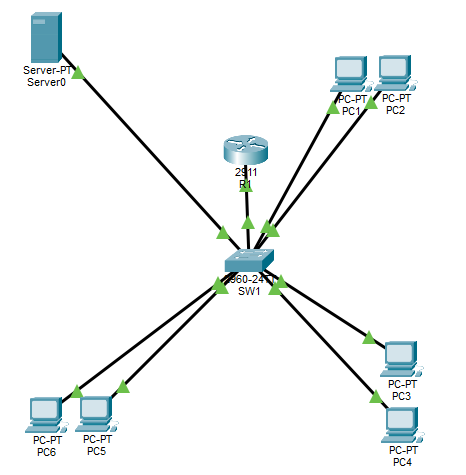

# Enterprise Secure Network

A Cisco Packet Tracer enterprise network project designed to demonstrate practical knowledge from three Cisco networking courses:

* Networking Basics
* Introduction to Cybersecurity
* Networking Devices and Initial Configuration

## Project Overview

This project simulates a small enterprise network with multiple departments, VLAN segmentation, inter-VLAN routing, DHCP, server services, SSH management, and switch port security.

The network was designed and configured using Cisco Packet Tracer.

## Network Topology

## VLAN Configuration

| VLAN | Name | Network | Gatew

