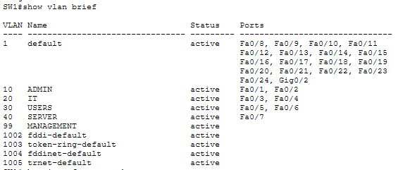
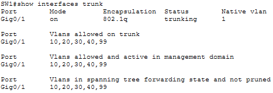
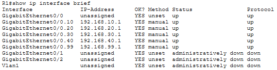
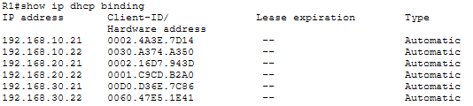
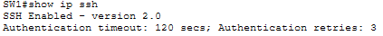
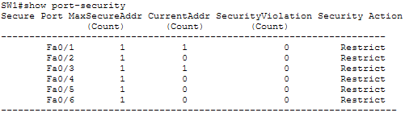
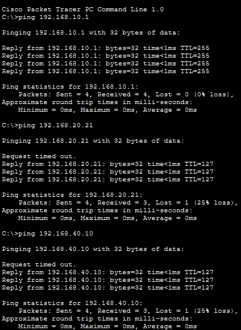
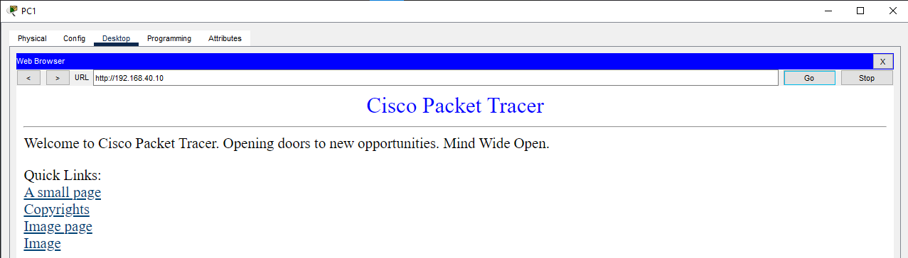

# Enterprise Secure Network

A Cisco Packet Tracer enterprise network project designed to demonstrate practical knowledge from three Cisco networking courses:

* Networking Basics
* Introduction to Cybersecurity
* Networking Devices and Initial Configuration

## Project Overview

This project simulates a small enterprise network with multiple departments, VLAN segmentation, inter-VLAN routing, DHCP, server services, SSH management, and switch port security.

The network was designed and configured using Cisco Packet Tracer.

## Network Topology


## VLAN Configuration

| VLAN | Name       | Network         | Gateway      |
| ---- | ---------- | --------------- | ------------ |
| 10   | ADMIN      | 192.168.10.0/24 | 192.168.10.1 |
| 20   | IT         | 192.168.20.0/24 | 192.168.20.1 |
| 30   | USERS      | 192.168.30.0/24 | 192.168.30.1 |
| 40   | SERVER     | 192.168.40.0/24 | 192.168.40.1 |
| 99   | MANAGEMENT | 192.168.99.0/24 | 192.168.99.1 |

### Device Allocation

* PC1–PC2 → VLAN 10 (ADMIN)
* PC3–PC4 → VLAN 20 (IT)
* PC5–PC6 → VLAN 30 (USERS)
* Server0 → VLAN 40 (SERVER)
* SW1 Management Interface → VLAN 99

## Networking Features

* IPv4 addressing
* Subnetting
* VLAN segmentation
* Access ports
* IEEE 802.1Q trunking
* Router-on-a-Stick
* Inter-VLAN routing
* DHCP
* DNS
* HTTP/HTTPS server
* Connectivity testing
* Cisco IOS configuration
* Basic network troubleshooting

## Cybersecurity Features

* SSH version 2
* Local user authentication
* Privileged EXEC password protection
* Console password protection
* VTY line security
* Password encryption
* MOTD security banner
* Port Security
* Sticky MAC addresses
* Maximum MAC address limit
* Port-security violation restriction
* Network segmentation using VLANs

## DHCP Configuration

DHCP pools were configured for:

* ADMIN
* IT
* USERS
* SERVER

The first 20 addresses in each subnet were excluded from DHCP allocation.

## Server Configuration

Server0 uses a static IP address:

* IP Address: `192.168.40.10`
* Subnet Mask: `255.255.255.0`
* Default Gateway: `192.168.40.1`

Enabled services:

* HTTP
* HTTPS
* DNS

DNS record:

`server.local` → `192.168.40.10`

## SSH Management

Secure remote management was configured on both R1 and SW1 using:

* Local username authentication
* RSA keys
* SSH version 2
* VTY line configuration
* SSH-only remote access

## Port Security

Port Security was configured on the user access ports:

* Fa0/1–Fa0/6
* Maximum 1 MAC address
* Sticky MAC address learning
* Violation mode: Restrict

## Verification and Testing

The following tests were performed:

### VLAN Verification

```text
show vlan brief
```



### Trunk Verification

```text
show interfaces trunk
```



### Router Interface Verification

```text
show ip interface brief
```



### DHCP Verification

```text
show ip dhcp binding
```



### SSH Verification

```text
show ip ssh
```



### Port Security Verification

```text
show port-security
```



### Connectivity Testing

Connectivity was tested between network devices, VLANs, and the server.



### HTTP Server Testing

The web server was tested from a client device using:

```text
http://192.168.40.10
```



## Skills Demonstrated

### Networking Basics

* Network communication
* IPv4 addressing
* Subnetting
* VLANs
* DHCP
* DNS
* ICMP
* TCP/IP fundamentals

### Introduction to Cybersecurity

* Network segmentation
* Secure remote access
* Authentication
* Password protection
* Port Security
* Unauthorized-device protection
* Basic security hardening

### Networking Devices and Initial Configuration

* Cisco IOS CLI
* Router configuration
* Switch configuration
* VLAN configuration
* Trunk configuration
* Router-on-a-Stick
* DHCP configuration
* SSH configuration
* Device verification
* Connectivity troubleshooting

## Project Files

* `Enterprise Secure Network.pkt` — Cisco Packet Tracer project
* `screenshots/` — Configuration and testing evidence
* `README.md` — Project documentation

## Tools Used

* Cisco Packet Tracer
* Cisco IOS CLI
* GitHub

## Project Status

Completed — Cisco Packet Tracer enterprise network configured, secured, tested, and documented.
