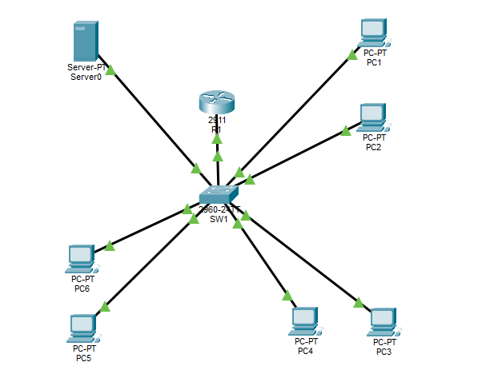

# Project 1 — Multi-Department Office Network

## Overview

This project demonstrates the design and configuration of a multi-department office network using Cisco Packet Tracer.

The network separates different departments using VLANs and provides communication between VLANs using Router-on-a-Stick inter-VLAN routing.

## Network Topology

## Network Departments

| VLAN | Department | Network | Default Gateway |
|---|---|---|---|
| 10 | ADMIN | 192.168.10.0/24 | 192.168.10.1 |
| 20 | IT | 192.168.20.0/24 | 192.168.20.1 |
| 30 | SALES | 192.168.30.0/24 | 192.168.30.1 |
| 40 | SERVER | 192.168.40.0/24 | 192.168.40.1 |

## Devices

- 1 Cisco Router
- 1 Cisco Switch
- 6 PCs
- 1 Server

## Technologies & Concepts

- IPv4 Addressing
- Subnet Masks
- VLAN Configuration
- 802.1Q Trunking
- Router-on-a-Stick
- Inter-VLAN Routing
- DHCP
- ARP
- MAC Address Learning
- ICMP / Ping
- Basic Network Troubleshooting

## DHCP

DHCP was configured on the router for the three client departments.

| VLAN | DHCP Range |
|---|---|
| ADMIN | 192.168.10.21 – 192.168.10.254 |
| IT | 192.168.20.21 – 192.168.20.254 |
| SALES | 192.168.30.21 – 192.168.30.254 |

The server uses a static IP address:

`192.168.40.10`

## Verification

The following configurations and tests were verified:

- VLAN configuration
- 802.1Q trunking
- Router subinterfaces
- DHCP address assignment
- Inter-VLAN connectivity
- Network interface status

## Evidence

Screenshots of the configuration and verification are available in the `screenshots` folder.

## Packet Tracer File

[Download the Packet Tracer project](./multi-department-office-network.pkt)
